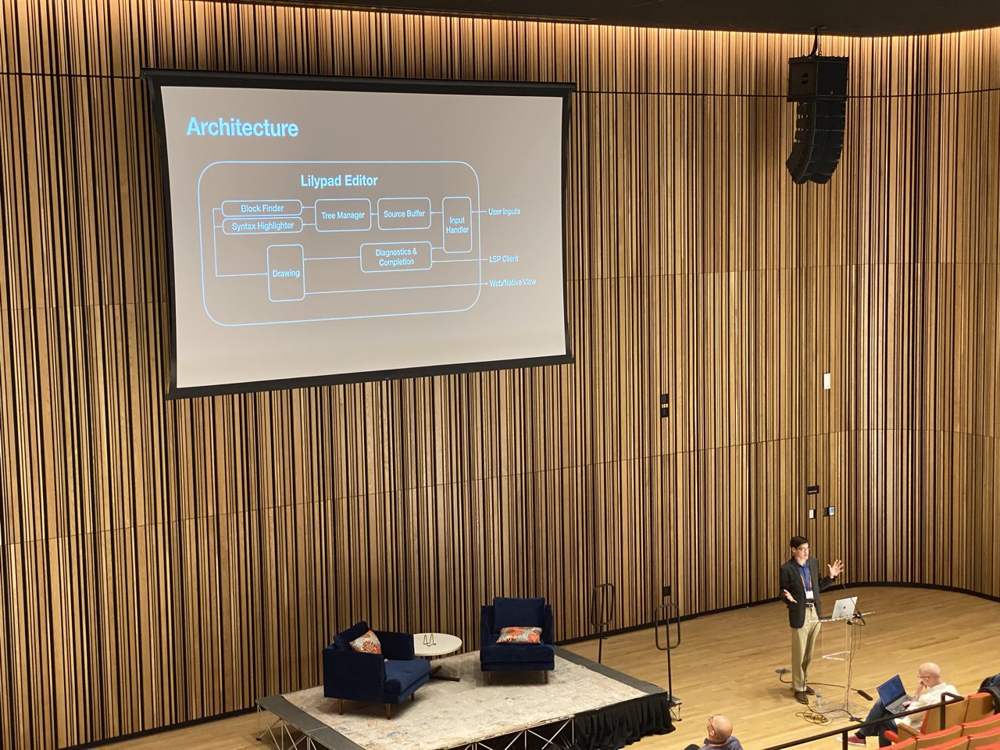

# Hi, I'm Liam!

I’m currently studying computer engineering and mathematics at the University of Florida.

My research there focuses on programming education, human-computer interaction, and distributing apps via web assembly.

*Note:* this is a website for my involvement with the University Scholars Program at UF. If you are not looking for that, [this](https://liamrosenfeld.com) is probably the website you're looking for.
