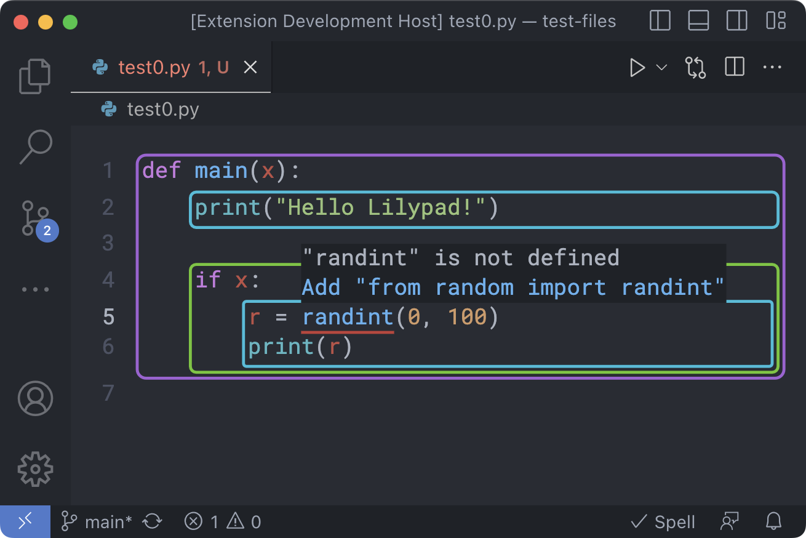

I have been working on a research project called Lilypad with Dr. Jeremiah Blanchard and a team of undergraduate and graduate students.

## What is Lilypad?

Research on dual-modality (able to switch between block and text representations) and frame-based (editing text through manipulating nodes of the syntax tree) editors has uncovered strengths and weaknesses to block-oriented approaches to programming and instruction. We are developing Lilypad, a text-based visual code editor, building on lessons learned from these editing models.

Lilypad is a modern text-based code editor that generates visual frames around code structures in real-time. Lilypad is designed to simplify the addition of new languages and can operate as a native-code standalone application, plugin, or web-based editor.

Lilypad (as of 2023) looks like this:

As you edit source code directly, Lilypad visualizes the structure of your code live using background outlines. You can interact with these outlines by holding option to switch into dragging mode, allowing you to quickly restructure your code without worrying about leaving something important behind. Additionally there are various structural editing affordances, meant to reduce the amount of time code spends in an invalid state.

Lilypad additionally integrates into existing development ecosystems, taking advantage of standards such as the Language Server Protocol, to have language tools such as code completions and diagnostics that are the same as professional tools.

## My Involvement

My Freshman year, I joined the team working on Droplet, a dual-modality code editor. I joined the team at a point where they were about to start off an a fresh new approach which we called Lilypad, with the goal of building an editor with the benefits of dual modality, without the need to switch between modes. I started with leading development of it and then started additionally leading the team as a whole my Sophomore year. I have been leading the team since then and was the architect of the current version of Lilypad.

## What We Have Accomplished So Far

We have launched a [Visual Studio Code extension](https://marketplace.visualstudio.com/items?itemName=CactiCouncil.lilypad-vscode) that adds the Lilypad editor as the code editor within an existing development environment and ran a small study on using that editor in an introductory programming class.

Additionally, the Lilypad editor is [open source](https://github.com/cacticouncil/lilypad). The source code has additionally become useful to the web assembly community at large because we have solved a collection of problems that arise when building a code editor in web assembly.

I was also first author on the [paper introducing Lilypad](https://ieeexplore.ieee.org/document/10305659), which I presented at IEEE VL/HCC 2023.

## What's Next

We are continuing to develop Lilypad, further refining the user experience and improving the performance and stability. We are also currently running a larger study to observe the impacts using the editor has on early programming education. I am also preparing the project to be able to effectively continue after my graduation.
